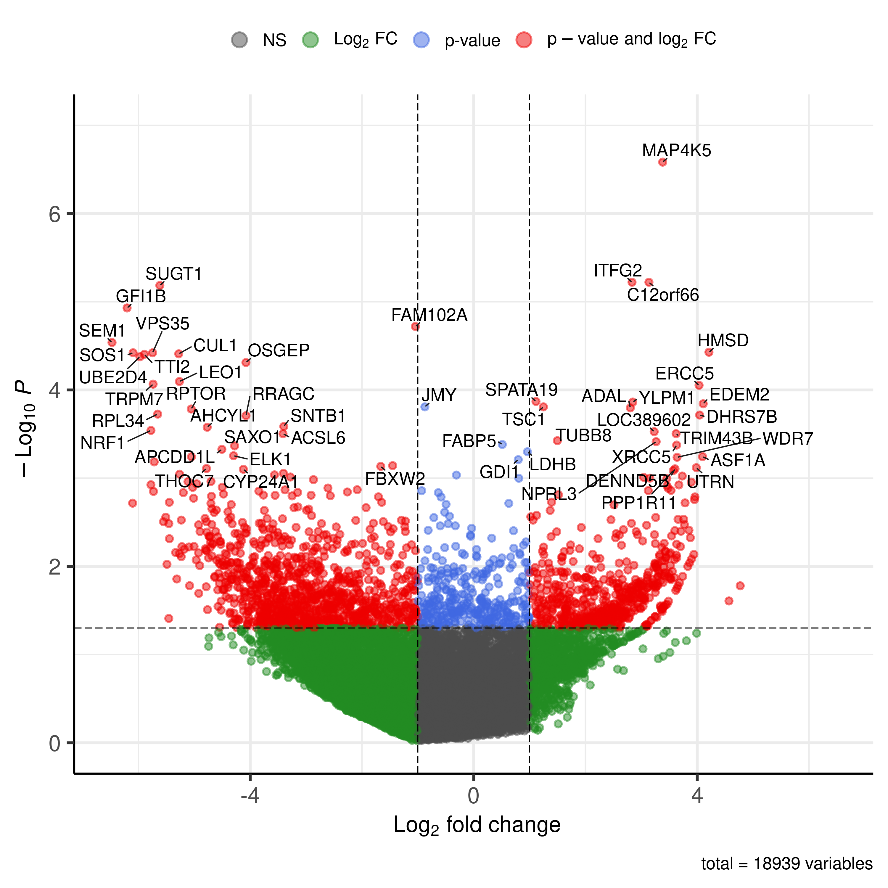
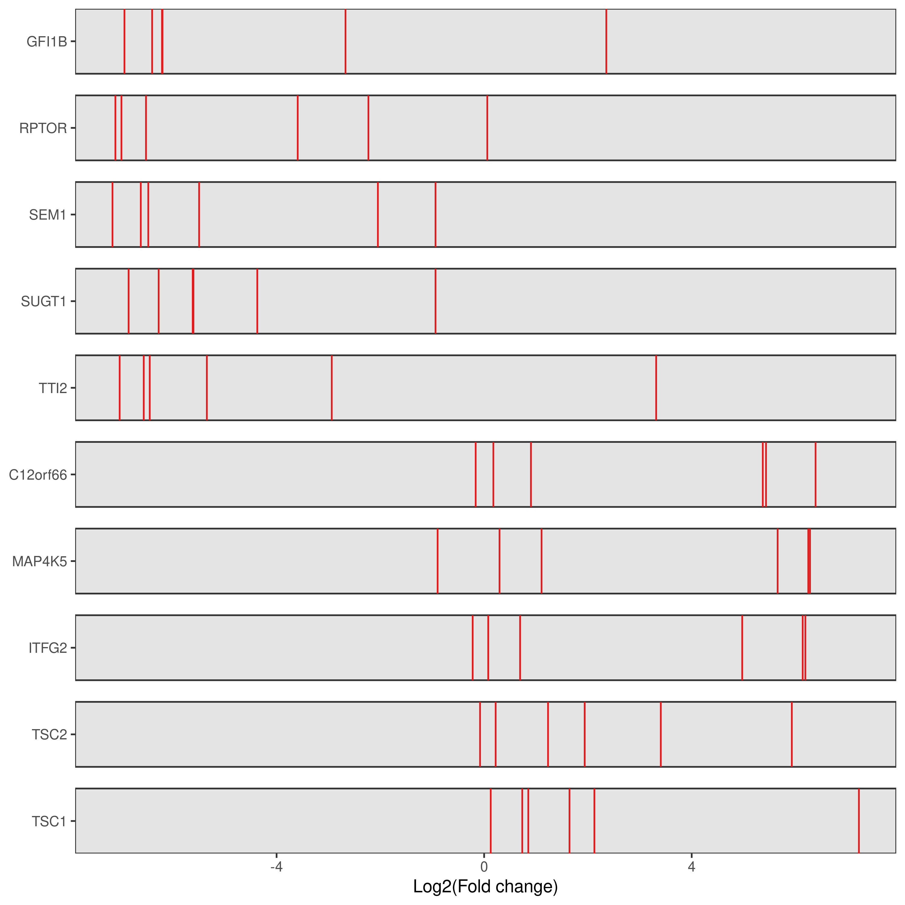

Figure 2 plots
================
2026-05-06

Figures 2A,B,D illustrator files

``` r
TvB.gene_summary <- read.delim("/brahms/blairj/PhosphoScreen/Screen6_7/TvB.gene_summary.txt")
TvB.gene_summary$smaller_value <- pmin(TvB.gene_summary$neg.p.value, TvB.gene_summary$pos.p.value)
TvB.gene_summary$smaller_rank <- pmin(TvB.gene_summary$neg.rank, TvB.gene_summary$pos.rank)
TvB.gene_summary$smaller_rank <- (TvB.gene_summary$smaller_rank)/18939
genes_lab <- c(
  TvB.gene_summary$id[order(TvB.gene_summary$neg.rank)][1:25],
  TvB.gene_summary$id[order(TvB.gene_summary$pos.rank)][1:25]
)
p1 <- EnhancedVolcano(TvB.gene_summary,TvB.gene_summary$id,"neg.lfc","smaller_value",drawConnectors = T,arrowheads = F,selectLab = genes_lab,xlim = c(-6.5,6.5),ylim = c(0,7),FCcutoff = 1,pCutoff = 0.05,title = NULL,subtitle = NULL)
```

    ## Warning: Using `size` aesthetic for lines was deprecated in ggplot2 3.4.0.
    ## ℹ Please use `linewidth` instead.
    ## ℹ The deprecated feature was likely used in the EnhancedVolcano package.
    ##   Please report the issue to the authors.
    ## This warning is displayed once per session.
    ## Call `lifecycle::last_lifecycle_warnings()` to see where this warning was
    ## generated.

    ## Warning: The `size` argument of `element_line()` is deprecated as of ggplot2 3.4.0.
    ## ℹ Please use the `linewidth` argument instead.
    ## ℹ The deprecated feature was likely used in the EnhancedVolcano package.
    ##   Please report the issue to the authors.
    ## This warning is displayed once per session.
    ## Call `lifecycle::last_lifecycle_warnings()` to see where this warning was
    ## generated.

``` r
plot(p1)
```

<!-- -->

``` r
TvB.sgrna_summary <- read.delim("/brahms/blairj/PhosphoScreen/Screen6_7/TvB.sgrna_summary.txt")

p3 = sgRankView(TvB.sgrna_summary,gene =c("TSC1","TSC2","ITFG2","MAP4K5","C12orf66","TTI2","SUGT1","SEM1","RPTOR","GFI1B"),top=0,bottom = 0)
```

    ## Warning: `aes_string()` was deprecated in ggplot2 3.0.0.
    ## ℹ Please use tidy evaluation idioms with `aes()`.
    ## ℹ See also `vignette("ggplot2-in-packages")` for more information.
    ## ℹ The deprecated feature was likely used in the MAGeCKFlute package.
    ##   Please report the issue to the authors.
    ## This warning is displayed once per session.
    ## Call `lifecycle::last_lifecycle_warnings()` to see where this warning was
    ## generated.

``` r
plot(p3)
```

<!-- -->
