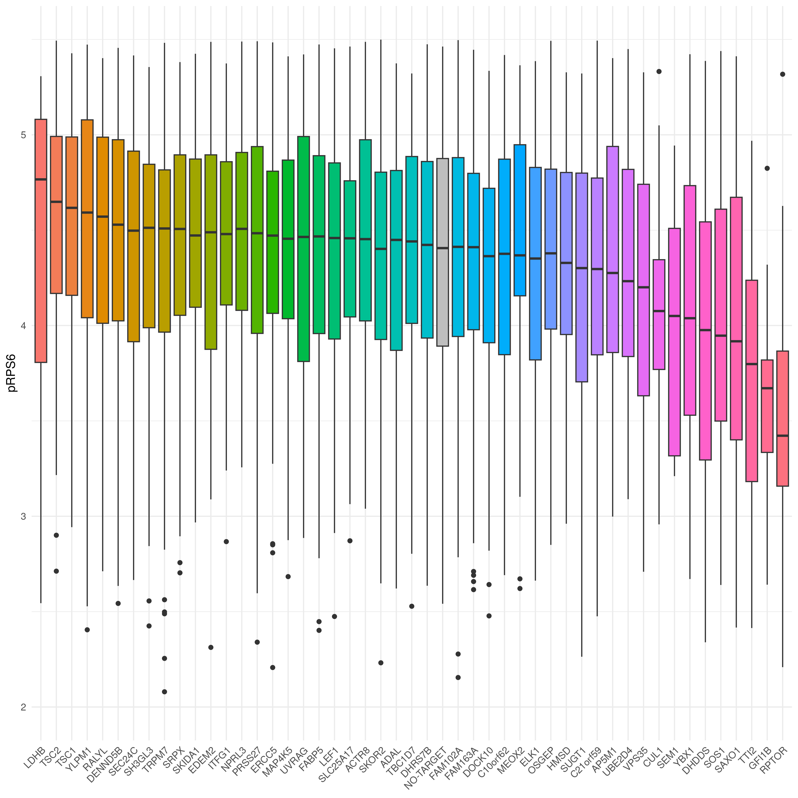
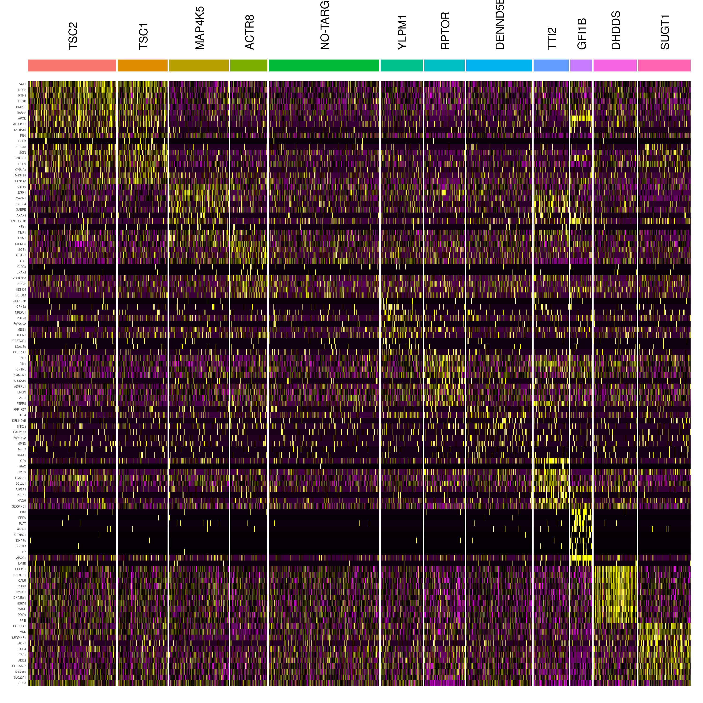
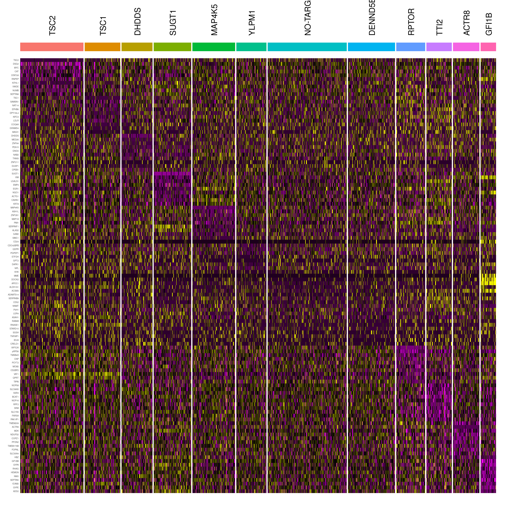

Figure 3 plots
================
2026-05-06

Figures 3A illustrator files

``` r
Glossary <- readRDS("/brahms/blairj/FLEX/FLEX8/Glossary.rds")
Glossary_pRPS6 <- GetAssayData(Glossary,assay = "ADT")
Glossary_pRPS6 <- as.data.frame(Glossary_pRPS6)
Glossary_pRPS6 <- as.data.frame(t(Glossary_pRPS6))
Glossary_pRPS6_md <- Glossary@meta.data     
Glossary_pRPS6$ident <- Glossary_pRPS6_md$GDO_comb

result_pRPS6 <- Glossary_pRPS6_md %>%
  group_by(GDO_comb) %>%
  summarise(median_pRPS6 = median(pRPS6_value))

result_pRPS6 <- result_pRPS6[order(result_pRPS6$median_pRPS6, decreasing = TRUE), ,drop=F]

levels_pRPS6 <- result_pRPS6$GDO_comb

# Reorder the factor levels for the x-axis
Glossary_pRPS6$ident <- factor(Glossary_pRPS6$ident, levels = c(levels_pRPS6))


# Get default ggplot2 palette for all levels
library(scales)
```

    ## 
    ## Attaching package: 'scales'

    ## The following object is masked from 'package:readr':
    ## 
    ##     col_factor

``` r
n_idents <- length(unique(Glossary_pRPS6$ident))

default_cols <- hue_pal()(n_idents)

# Name them after the factor levels
names(default_cols) <- levels(Glossary_pRPS6$ident)

# Override only NO-TARGET color
default_cols["NO-TARGET"] <- "grey"

p1 <- ggplot(Glossary_pRPS6, aes(x = ident, y = pRPS6, fill = ident)) +
  geom_boxplot() +
  scale_fill_manual(values = default_cols) +
  theme_minimal() +
  ylim(2, 5.5) +
  NoLegend() +
  theme(axis.text.x = element_text(angle = 45, hjust = 1),
        axis.title.x = element_blank())

plot(p1)
```

    ## Warning: Removed 35 rows containing non-finite outside the scale range
    ## (`stat_boxplot()`).

<!-- -->

Import the “MakeQCHeatmap” function

``` r
make_QC_heatmap <- function(seurat_obj, group.by=NULL, cells.order=NULL, n_downsample = 200, save_folder_path = NULL, logfc_cutoff = log(2), n_markers = 10, text.size=3, text.angle=90, min_size=NULL, max_size=NULL, min.pct=0.1, reorder = TRUE, switch_id=NULL, return.genes=FALSE, pos.markers=TRUE, genes_to_plot=NULL) {
  if (!is.null(group.by)) Idents(seurat_obj) <- group.by
  if (!is.null(min_size)) {
    seurat_obj <- subset(seurat_obj,idents = names(which(table(Idents(seurat_obj))>=min_size)))
  }
  if (!is.null(max_size)) {
    seurat_obj <- subset(seurat_obj,idents = names(which(table(Idents(seurat_obj))<=max_size)))
  }
  if (!is.null(n_downsample)) seurat_obj <- subset(seurat_obj, downsample=n_downsample)
  if (pos.markers) {
    mark_all <- FindAllMarkers(seurat_obj,only.pos = TRUE,min.pct = min.pct)
  }
  if (!(pos.markers)) {
    mark_all <- FindAllMarkers(seurat_obj,only.pos = FALSE,min.pct = min.pct)
    mark_all <- subset(mark_all, avg_log2FC<0)
  }
  mark_all %>% group_by(cluster) %>%
    dplyr::filter(abs(avg_log2FC) > logfc_cutoff) %>%
    slice_head(n = n_markers) %>%
    ungroup() -> top_markers
  
  if (!is.null(switch_id)) {
    Idents(seurat_obj) <- switch_id
  }
  seurat_obj <- ScaleData(seurat_obj,features = top_markers$gene)
  
  if (reorder) {
    # Compute average profiles for each cell type
    average_profiles <- LayerData(seurat_obj,layer = 'scale.data') %>%
      as.data.frame() %>%
      t() %>%
      as.data.frame() %>%
      rownames_to_column("Cell") %>%
      left_join(data.frame(Cell = Cells(seurat_obj), CellType = Idents(seurat_obj)), by = "Cell") %>%
      group_by(CellType) %>%
      summarise(across(where(is.numeric), mean, na.rm = TRUE)) %>% # Use `where(is.numeric)` to avoid non-numeric columns
      column_to_rownames("CellType")
    

    dist_matrix <- dist(as.matrix(cor(t(average_profiles))))
    hclust_results <- hclust(dist_matrix)
    
    # Extract the ordered cell types from the dendrogram
    ordered_cell_types <- hclust_results$labels[hclust_results$order]
    
    # Step 4: Reorder the Idents of the Seurat object based on the dendrogram
    seurat_obj <- SetIdent(seurat_obj, value = factor(Idents(seurat_obj), levels = ordered_cell_types))
  
      
    # Step 5: Reorder the top_markers dataframe based on ordered_cell_types
    top_markers <- top_markers %>%
      mutate(cluster = factor(cluster, levels = ordered_cell_types)) %>%
      arrange(cluster)
  }
  if (is.null(genes_to_plot)) {
    genes_to_plot <- top_markers$gene
  }
  if (return.genes) {
    return(top_markers)
  }

  seurat_obj <- ScaleData(seurat_obj,features = genes_to_plot)
  cells.plot <- names(which(!is.na(Idents(seurat_obj))))
  if (!is.null(cells.order)) cells.plot <- intersect(cells.order,cells.plot)
  plot_heatmap <- DoHeatmap(seurat_obj,features = genes_to_plot,cells = cells.plot,size = 4, angle = text.angle)+theme(
    axis.text.y = element_text(size = text.size)) + NoLegend()
  if (!is.null(save_folder_path))  ggsave(paste0(save_folder_path, identity, "_heatmap.png"))
  if (is.null(save_folder_path))return(plot_heatmap)
}
```

``` r
sub <- subset(Glossary,idents = c("TSC2","TSC1","MAP4K5","ACTR8","NO-TARGET","YLPM1","RPTOR","DENND5B","TTI2","GFI1B","DHDDS","SUGT1"))
levels(sub) <- c("TSC2","TSC1","MAP4K5","ACTR8","NO-TARGET","YLPM1","RPTOR","DENND5B","TTI2","GFI1B","DHDDS","SUGT1")
sub_rna <- LayerData(sub,layer = 'data',assay = 'RNA')
prps6 <- FetchData(sub,"adt_pRPS6")
sub_rna <- rbind(sub_rna, prps6$adt_pRPS6)
rownames(sub_rna)[nrow(sub_rna)] <- 'pRPS6'

new_assay <- CreateAssay5Object(data=sub_rna)
sub1 <- CreateSeuratObject(new_assay,meta.data = sub@meta.data)
```

    ## Warning: No layers found matching search pattern provided

    ## Warning: Cannot find the layer(s) specified

``` r
Idents(sub1) <- Idents(sub)
g1 <- make_QC_heatmap(sub1,return.genes = TRUE)
```

    ## Calculating cluster TSC2

    ## Calculating cluster TSC1

    ## Calculating cluster MAP4K5

    ## Calculating cluster ACTR8

    ## Calculating cluster NO-TARGET

    ## Calculating cluster YLPM1

    ## Calculating cluster RPTOR

    ## Calculating cluster DENND5B

    ## Calculating cluster TTI2

    ## Calculating cluster GFI1B

    ## Calculating cluster DHDDS

    ## Calculating cluster SUGT1

    ## Centering and scaling data matrix

    ## Warning: No layers found matching search pattern provided

    ## Warning: There was 1 warning in `summarise()`.
    ## ℹ In argument: `across(where(is.numeric), mean, na.rm = TRUE)`.
    ## ℹ In group 1: `CellType = TSC2`.
    ## Caused by warning:
    ## ! The `...` argument of `across()` is deprecated as of dplyr 1.1.0.
    ## Supply arguments directly to `.fns` through an anonymous function instead.
    ## 
    ##   # Previously
    ##   across(a:b, mean, na.rm = TRUE)
    ## 
    ##   # Now
    ##   across(a:b, \(x) mean(x, na.rm = TRUE))

``` r
p1b <- make_QC_heatmap(sub1,genes_to_plot = c(g1$gene,"pRPS6"))
```

    ## Calculating cluster TSC2

    ## Calculating cluster TSC1

    ## Calculating cluster MAP4K5

    ## Calculating cluster ACTR8

    ## Calculating cluster NO-TARGET

    ## Calculating cluster YLPM1

    ## Calculating cluster RPTOR

    ## Calculating cluster DENND5B

    ## Calculating cluster TTI2

    ## Calculating cluster GFI1B

    ## Calculating cluster DHDDS

    ## Calculating cluster SUGT1

    ## Centering and scaling data matrix

    ## Warning: No layers found matching search pattern provided

    ## Centering and scaling data matrix

    ## Warning: Different features in new layer data than already exists for
    ## scale.data

``` r
plot(p1b)
```

<!-- -->

``` r
g2 <- make_QC_heatmap(sub1,return.genes = TRUE,pos.markers = FALSE)
```

    ## Calculating cluster TSC2

    ## Calculating cluster TSC1

    ## Calculating cluster MAP4K5

    ## Calculating cluster ACTR8

    ## Calculating cluster NO-TARGET

    ## Calculating cluster YLPM1

    ## Calculating cluster RPTOR

    ## Calculating cluster DENND5B

    ## Calculating cluster TTI2

    ## Calculating cluster GFI1B

    ## Calculating cluster DHDDS

    ## Calculating cluster SUGT1

    ## Centering and scaling data matrix

    ## Warning: No layers found matching search pattern provided

``` r
p2b <- make_QC_heatmap(sub1,genes_to_plot = c(g2$gene,"pRPS6"),pos.markers = FALSE)
```

    ## Calculating cluster TSC2

    ## Calculating cluster TSC1

    ## Calculating cluster MAP4K5

    ## Calculating cluster ACTR8

    ## Calculating cluster NO-TARGET

    ## Calculating cluster YLPM1

    ## Calculating cluster RPTOR

    ## Calculating cluster DENND5B

    ## Calculating cluster TTI2

    ## Calculating cluster GFI1B

    ## Calculating cluster DHDDS

    ## Calculating cluster SUGT1

    ## Centering and scaling data matrix

    ## Warning: No layers found matching search pattern provided

    ## Centering and scaling data matrix

``` r
plot(p2b)
```

<!-- -->
